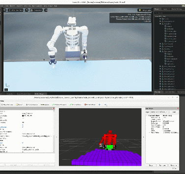

# Rosie: Mecanum-Wheeled Home Assistant Robot

Rosie is a home assistant robot designed for object detection, grasping, and navigation. This project explores autonomous mobility, human-robot interaction, and real-world deployment.  
**August 2024 - June 2025**

<div align="center">
  <a href="https://www.youtube.com/watch?v=qHLM9LW5f4Y">
    
  </a>
  
  <br> <p>
    <a href="https://www.youtube.com/watch?v=qHLM9LW5f4Y">
      <b>🎥 Click here to watch the demo</b>
    </a>
  </p>
</div>

---

## What is Rosie?

A humanoid mobile robot with:
- 🧭 **Autonomous Navigation** (SLAM + Nav2)
- 👁️ **Object Detection** (YOLOv8)  
- 🦾 **Two Arms with Hands** (dexterous manipulation)
- 🚗 **Holonomic Motion** (Mecanum wheels - strafe in any direction)

**Hardware Stack:** Jetson Nano (AI) → Raspberry Pi (ROS2) → ESP32 (motor control)

---

## Quick Start

### Setup
```bash
git clone <repo-url> Rosie-Robot && cd Rosie-Robot
rosdep install -r --from-paths src --ignore-src --rosdistro humble -y
colcon build --symlink-install
source install/setup.bash
```

### Launch Navigation Stack
```bash
ros2 launch rosie_navigation bringup.launch.py
```

This starts:
- ✅ Motors & Lidar
- ✅ SLAM Mapping
- ✅ Nav2 Autonomous Navigation
- ✅ RViz Visualization

### Arm + Detection
```bash
# Terminal 2 - Object detection
ros2 launch yolov8_obb yolov8_obb.launch.py

# Terminal 3 - Arm control
ros2 launch rosie_moveit_config rosie_moveit_launch.py
```

### Learned 6-DoF grasping

`rosie_grasp` consumes Rosie’s existing `/image_raw`, `/depth`, `/camera_info`,
`/Yolov8_Inference`, and TF2 streams. Contact-GraspNet stays outside the ROS
workspace in its own virtual environment; see `src/rosie_grasp/README.md`.

```bash
colcon build --symlink-install --packages-select rosie_grasp rosie_moveit_config
source install/setup.bash
ros2 launch rosie_grasp grasp_pose.launch.py \
  checkpoint_path:=/opt/contact_graspnet/checkpoints/contact_graspnet.pt \
  camera_frame:=camera_color_optical_frame base_frame:=base_link
ros2 launch rosie_moveit_config rosie_moveit_launch.py
# debug-only legacy mode:
ros2 run rosie_moveit_config arm_control_from_UI.py --ros-args -p grasp_mode:=legacy
```

The model adapter deliberately does not invent an orientation from the YOLO OBB:
the quaternion must come from the learned candidate. `grasp_pose` is the selected
base-frame `geometry_msgs/PoseStamped`; `grasp_candidates` is a camera-frame
`PoseArray` for RViz/debugging.

## System Architecture

```
Jetson Nano (AI inference)
    ↓ /detections
Raspberry Pi (ROS2: Nav2, MoveIt2)
    ↓ /cmd_vel
ESP32 (Motor driver)
    ↓ Serial UART
Motors & Sensors
```

---

## Package Structure

```
src/
├── rosie_navigation/          # Main unified bringup (SLAM + Nav2)
├── mecanumbot_bringup/        # Hardware drivers
├── mecanumbot_control/        # Motor controller
├── rosie_moveit_config/       # Arm motion planning
├── rosie_grasp/               # Learned 6-DoF grasp estimation
├── yolov8_obb/                # Object detection
├── rosie_description/         # Robot URDF
└── custom_message/            # Message definitions
```

---

## Hardware Specs

| Component | Spec |
|-----------|------|
| **Compute** | Jetson Nano + Raspberry Pi + ESP32 |
| **Wheels** | 4× Mecanum (omnidirectional) |
| **Sensors** | LiDAR, IMU, Depth Camera |
| **Actuators** | 4× DC motors, 6-DOF arm, gripper |
| **Base Size** | 0.285m × 0.17m × 0.082m |
| **Max Speed** | 1.0 m/s (forward/strafe) |

---

## Next Steps

- 🔄 Optimize SLAM in complex environments
- 📚 Train custom YOLO on household objects
- 🎯 Improve grasping accuracy
- 🤖 Multi-object task planning

---

## Quick Links

- [ROS2 Humble](https://docs.ros.org/en/humble/)
- [Nav2 Navigation](https://navigation.ros.org/)
- [MoveIt2](https://moveit.picknik.ai/)
- [SLAM Toolbox](https://github.com/SteveMacenski/slam_toolbox)
- [MicroROS-Car-Pi5 Reference](https://github.com/YahboomTechnology/MicroROS-Car-Pi5)
